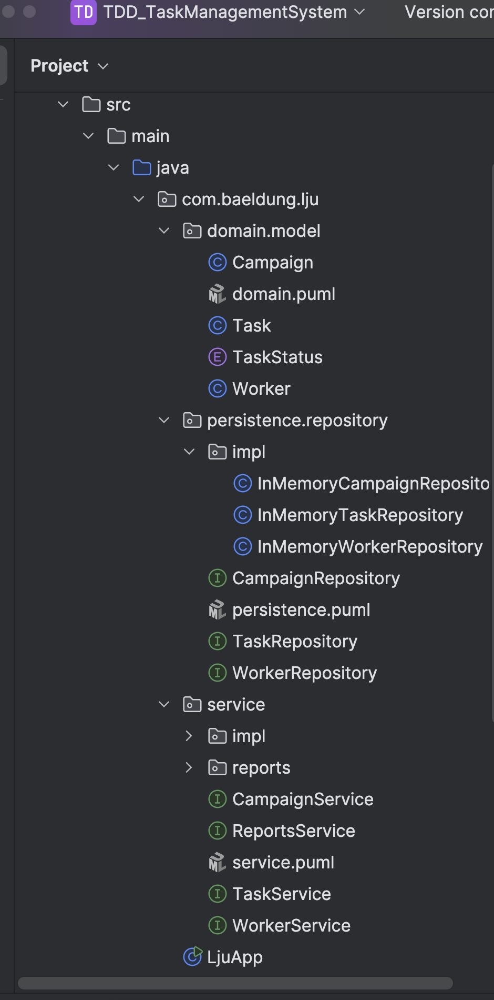
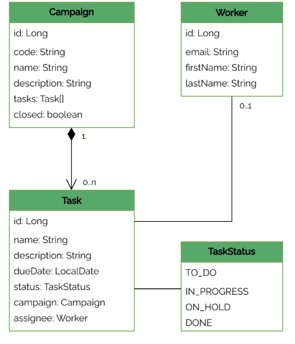
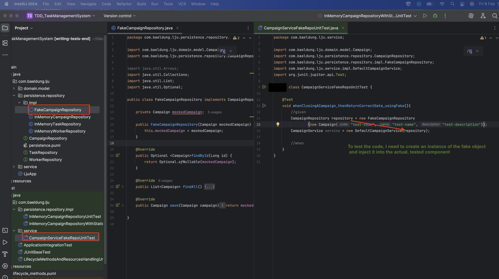
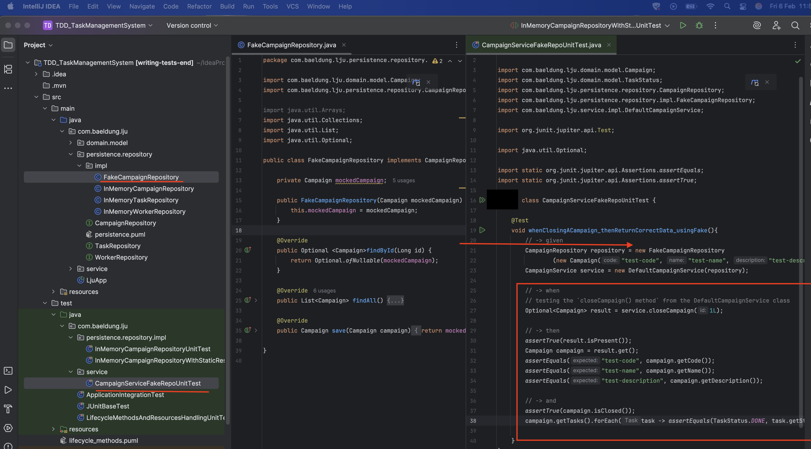

# esirgeyen ve bağışlayan Allah'ın (c.c) adıyla - 14
## 14b_baeldung_course_TDD_TaskManagementSystem 

## Table of Contents
- [1_task_management_system_introduction](#1_task_management_system_introduction)
- [2_domainlayer](#2_domainlayer)
- [3_persistencelayer](#3_persistencelayer)
- [4_businesslayer](#4_businesslayer)
- [5_running_the_application](#5_running_the_application)  <!--##SONN-->
- [test_packages_incele] <!--##SONN-->
- [6_testing](#6_testing)
  - [6.0_test_execution](#60_test_execution)
  - [6.1_unit_test](#61_unit_test)
  - [6.2_integration_test](#62_integration_test)
  - [6.3_testing_the_side_effect](#63_testing_the_side_effect)
- [7_plugins]
  - [7.1_maven_surefire_plugin](#71_maven_surefire_plugin)
- [8_lifecycle_methods]  
  - [8.1_@BeforeEach](#81_beforeeach)
  - [8.2_@AfterEach](#82_beforeeach)
  - [8.3_@BeforeAll](#83_beforeeach)
  - [8.4_@AfterAll](#84_beforeeach)
- [9_implementing_lifecycle_methods_for_the_application](#9_implementing_lifecycle_methods_for_the_application)
  - [9.1_nonstatic](#91_nonstatic)
  - [9.2_static](#92_static)
- [10_Mocking_With_Fake_Implementations](#10_mocking_with_fake_implementations)
- [11_Mocking_With_Mockito](#11_Mocking_With_Mockito)
- [12_Mocks_Initialization_and_TestLifecycle](#12_Mocks_Initialization_and_TestLifecycle)
  - [12.1_Mocks_Initialization](#121_Mocks_Initialization)
  - [12.2_TestLifecycle](#122_TestLifecycle)
  - [12.3_Mockito_annotations ](#123_Mockito_annotations)
<!--###############################-->

# 1_task_management_system_introduction
- The application that I’ll be testing is a `task management system`. As represented in `three-tier design.puml`, it has a multi tier architecture. There’s no presentation layer present. The main method can therefore act as the `presentation layer`,
- Everything is rooted in ``com.student.lju`` and main entry point  is ``LjuApp class``
- The package structure is as follows;
- 
# 2_domainlayer
- There is one-to-many relationship from Campaign to Task, and again from Worker to Task. 
  - One `campagin` can be assigned to multiple tasks 
  - One `worker` can be assigned to multiple tasks 

- There are three domain classes <b> Campaigns, Tasks, and Workers. </b>
- Each of these has a number of attributes that describe them and relationships between them  is represented as 
- 
# 3_persistencelayer
It contains data interfaces for persistence
- `persistence.repository` package contains three Repository interfaces. One for <b>each of my domain entities</b>
and there are in-memory <b>implementations</b> of the classes under repository package within the `persistence.repository.impl`
# 4_businesslayer
It contains all the `service/business` logic together with the interfaces to interact with.
- `service`  package contains four Service interfaces.<b> One for each of the domain entities and one more as well – ReportsService.</b>

- There are default implementations of all of these services in the `service.impl`  package.

- Three service implementations depend only on the appropriate repository whereas the `ReportsService`  has references to the ``TaskService and WorkerService services``to generate the reports.
- Having said that `regarding testing purpose; it is observed that repository implementations are all entirely independent, whereas the service implementations all have dependencies.` 

- the `CampaignService, TaskService, and WorkerService are all independent`, but `the ReportsService depends on those`.
# 5_running_the_application
- it executes certain use cases and logs the outputs.
 <!--##SONN-->

# 6_testing
## 6.0_test_execution
- `mvn test` finds and runs all project tests

- running specific tests `mvn test -Dtest= {test_class_name} `

- `mvn test -Dtest= InMemoryCampaignRepositoryUnitTest `
- `mvn test -Dtest=JUnitBaseTest`
- `mvn test -Dtest=ApplicationIntegrationTest`

- `mvn install -DskipTests` builds the project without executing the tests

-  `mvn test -Dtest=MyUnitTest#testMethod`

## 6.1_unit_test
Since the tests only executed code within a single class `InMemoryCampaignRepository`, so it’s safe to categorize them all as `unit tests`

The `InMemoryCampaignRepository` uses a java.util.Set interface to store Campaigns. In the unit tests, I have simply created `Set instances containing campaigns` and injected them in the `StateUnderTest`

## 6.2_integration_test
Since the `main method` involves the interaction between various components as it `creates instances of CampaignService, TaskService, and WorkerService, and uses them together to complete a more complex workflow`, the interaction among these services is essential for fulfilling the workflow, therefore, testing the main method as is would be a `full-fledged integration test`, certainly verifying that a lot of the functionality is working as expected in sync.

## 6.3_testing_the_side_effect
# 7_plugins

## 7.1_maven_surefire_plugin
- `mvn surefire:test`
- `mvn test`
# 8_lifecycle_methods
## 8.1_@BeforeEach
## 8.2_@AfterEach
## 8.3_@BeforeAll
## 8.4_@AfterAll
# 9_implementing_lifecycle_methods_for_the_application
## 9.1_nonstatic
- In  `@BeforeEach lifecycle_method`, `campaignRepositoryclass variable` is correctly initialized by running the `setupDataSource method before executing each test`,
- In  `@AfterEach lifecycle_method`, the `cleanup method` is also executed after executing each test.

## 9.2_static

# 10_Mocking_With_Fake_Implementations
## 10.0_start
- I’ll start with testing the `closeCampaign() method` from the DefaultCampaignService class, `DefaultCampaignService` relies on the `CampaignRepository component`. As a result, the behavior of closeCampaign() will be directly affected by this dependency:

## 10.1_simulation
- the only way to test this function in isolation will be to `<b>simulate campaignRepository during the testing phase.</b>` To achieve this, I can create an additional, `fake implementation of the CampaignRepository interface:`

- create a FakeCampaignRepository implementation that always `returns the same test value for the findById() method`, regardless of the id argument.

- use constructor injection to define a Campaign that will be always returned when calling findById():

## 10.2_testing_the_Code
- 
- 

This approach can be a useful and quick way of simulating the behavior of simple dependencies. Moreover, manually creating fake implementations will help us gain a deeper understanding of how mocks work internally and their role in software testing.

However, as we expand our test coverage to handle more intricate scenarios, maintaining these manually created mocks will become increasingly challenging for several reasons:

Not all dependencies we want to mock will implement an interface
Sometimes, we’ll want to define some basic mapping between the mocked method’s arguments and its response
We’ll need some mocks that throw exceptions instead of returning a value
We’ll need a convenient way of controlling the mock’s lifecycle
For these reasons, it can be tempting to add more and more logic inside the mock objects. Creating complex mocks is considered an antipattern that can make the test less clear, more fragile, and harder to maintain.

# 11_Mocking_With_Mockito
 Instead of manually created mocks (section 10), I can use Mockito 
 - add the `mockito-core` dependency to our pom.xml:

- `!!VIP`  
- 1- Mock the CampaignRepository (create a mock for the repository)
- 2- Create the CampaignService (inject repository into the CampaignService through its constructor.)

i.e I am testing service layer objects by `mocking` `repository interface (CampaignRepository)`, without needing to access persistent data while running unit tests.

# 12_Mocks_Initialization_and_TestLifecycle
Even though the test suite is pretty small, I can already notice some code duplication in the setup section (-> given) of the tests.
It seems like I always `create a mock for the repository and inject it into the CampaignService through its constructor.`

This is a very common case in which the `Test Lifecycle methods` come in handy.

## 12.1_Mocks_Initialization
reduce the duplicated code and adhere to the DRY principle.

## 12.2_TestLifecycle
`@BeforeEach`
- One way to avoid this code duplication will be to `move this common functionality into the @BeforeEach block`
- managed to reduce the duplicated code and adhere to the DRY principle.

## 12.3_Mockito_annotations 
- Mockito provides a set of useful annotations that allow me to further simplify the code. 
For example, I can 
- 1- `annotate the mocked dependency with @Mock` 
- 2- and the tested component with `@InjectMocks`

## 12.3_Mockito_s_JUnit_Extension
- Mockito has a dedicated `JUnit 5 extension - mockito-junit-jupiter` that allows me to enable these annotations more elegantly `without manually calling MockitoAnnotations.openMocks()`
